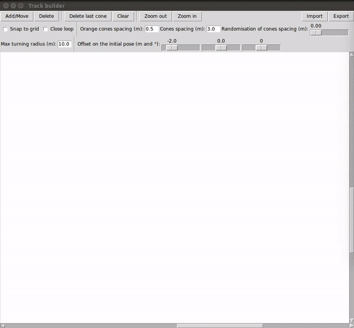

# track_builder



## Description
Small application to easily and quickly build Formula Student trackdrive tracks for simulation purposes.

It includes:
- Adding, moving and deleting waypoints defining the center line of the track
- Generation of blue, yellow and orange cones around the center line. The distance between them can be tuned and randomised.
- The starting pose of the car can be specified.
- Visual indication of too sharp turns exceeding a given maximum turning radius (indicated by a red center line).
- The track and the initial pose of the car can be exported/imported in YAML format.

Some of the parameters used by the software can be configured in the `src/config.py` file.

## Requirements
Tested on Ubuntu 16.04 and 18.04, with Python 3.
```
sudo apt install python3-tk
python3 -m pip install -r requirements.txt
```

## Run
```
python3 track_builder_gui.py
```
Enjoy!
